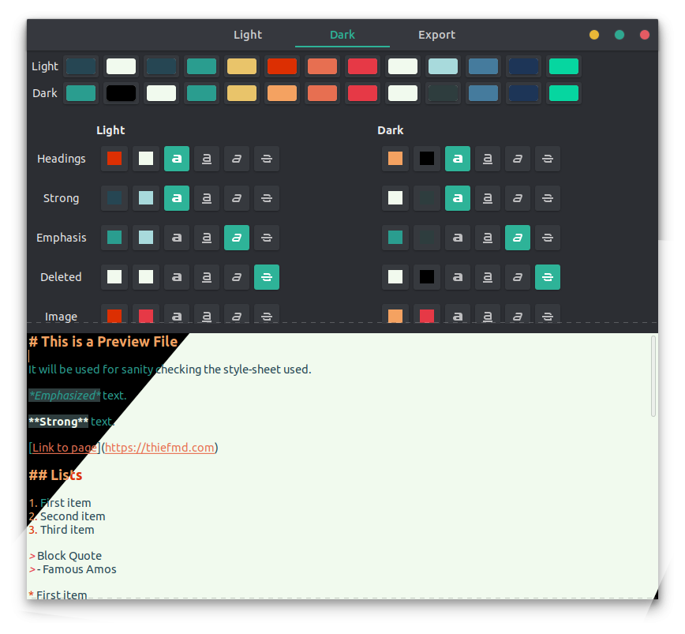
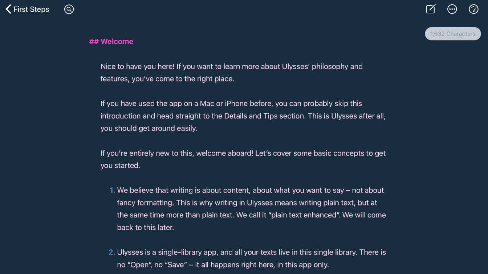
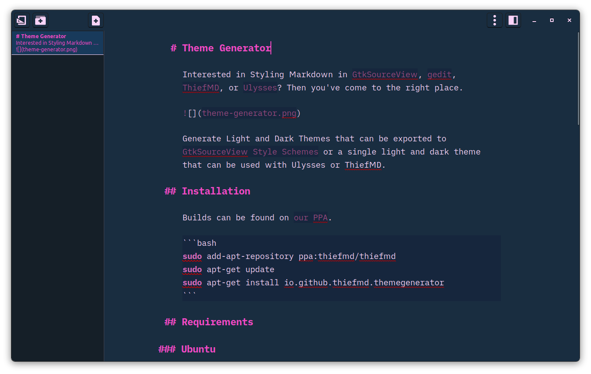
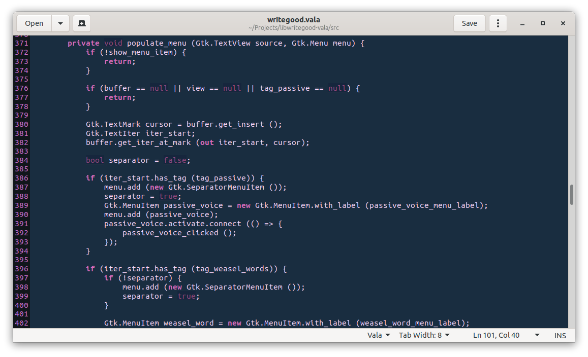
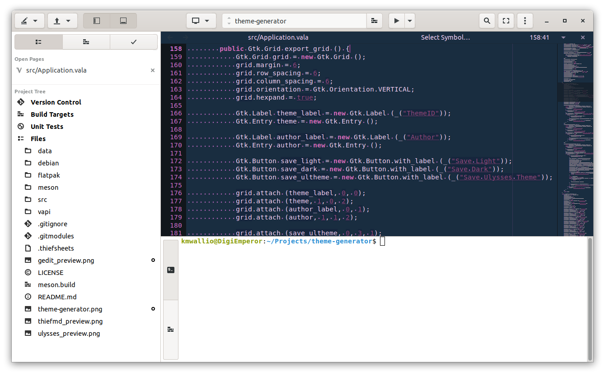

# Theme Generator

Interested in Styling Markdown in [GtkSourceView](https://wiki.gnome.org/Projects/GtkSourceView), [gedit](https://wiki.gnome.org/Apps/Gedit), [ThiefMD](https://thiefmd.com), or [Ulysses](https://ulysses.app)? Then you've come to the right place.



Generate Light and Dark Themes that can be exported to [GtkSourceView Style Schemes](https://wiki.gnome.org/Projects/GtkSourceView/StyleSchemes) or a single light and dark theme that can be used with Ulysses or ThiefMD.

## Installation

 is now available on Flathub. Make sure you've added [flathub](https://flatpak.org/setup) to your system.

```bash
flatpak install flathub io.github.thiefmd.themegenerator
```

### Ubuntu

Builds can be found on [our PPA](https://launchpad.net/~thiefmd/+archive/ubuntu/thiefmd).

```bash
sudo add-apt-repository ppa:thiefmd/thiefmd
sudo apt-get update
sudo apt-get install io.github.thiefmd.themegenerator
```

## Requirements

### Ubuntu

```
meson
ninja-build
valac
cmake
libarchive-dev
libclutter-1.0-dev
libxml2-dev
libgtk-3-dev
libgtksourceview-4-dev
```

### Fedora

```
vala
meson
ninja-build
cmake
clutter-gtk-devel
gtk3-devel
gtksourceview4-devel
libarchive-devel
libxml2-devel
libgee-devel
```

### Building with flatpak

```bash
$ git clone https://github.com/ThiefMD/theme-generator.git
$ cd theme-generator/flatpak
$ flatpak-builder --force-clean --user --install build-dir io.github.thiefmd.themegenerator.json
$ flatpak run io.github.thiefmd.themegenerator
```

### Building

```bash
$ meson build && cd build
$ meson configure -Dprefix=/usr
$ ninja
$ sudo ninja install
$ io.github.thiefmd.themegenerator
```

## Examples

### Ulysses



### ThiefMD



### gedit



### Builder

