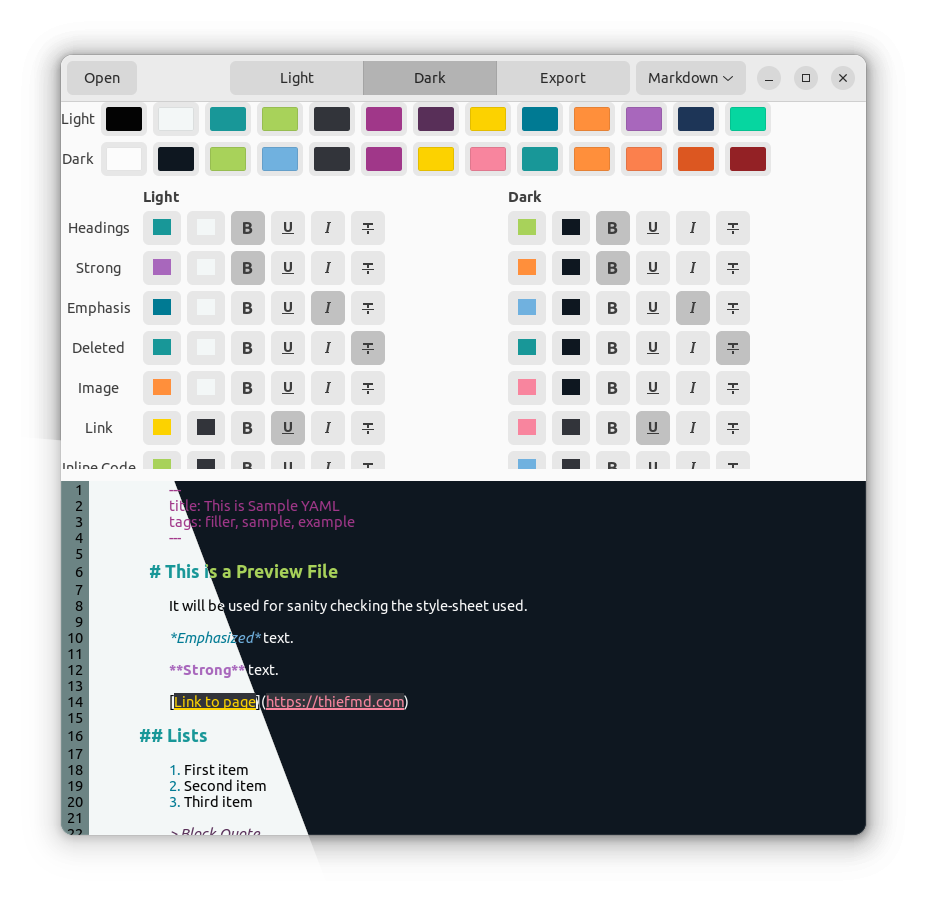

# Theme Generator

Interested in Styling Markdown in [GtkSourceView](https://wiki.gnome.org/Projects/GtkSourceView), [gedit](https://wiki.gnome.org/Apps/Gedit), [ThiefMD](https://thiefmd.com), or [Ulysses](https://ulysses.app)? Then you've come to the right place.



Generate Light and Dark Themes that can be exported to [GtkSourceView Style Schemes](https://wiki.gnome.org/Projects/GtkSourceView/StyleSchemes) or a single light and dark theme that can be used with Ulysses or ThiefMD.

## Requirements

### Ubuntu

```
meson
ninja-build
valac
cmake
libarchive-dev
libclutter-1.0-dev
libxml2-dev
libgtk-3-dev
libgtksourceview-3.0-dev
```

### Fedora

```
vala
meson
ninja-build
cmake
clutter-gtk-devel
gtk3-devel
gtksourceview3-devel
libarchive-devel
```

### Building with flatpak

```bash
$ git clone https://github.com/ThiefMD/theme-generator.git
$ cd theme-generator
$ meson subprojects update
$ cd flatpak
$ flatpak-builder --force-clean --user --install build-dir io.github.thiefmd.themegenerator.json
$ flatpak run io.github.thiefmd.themegenerator
```

### Building

As part of the build, [gxml](https://gitlab.gnome.org/GNOME/gxml) will be cloned and built.

```bash
$ meson build && cd build
$ meson configure -Dprefix=/usr
$ ninja
$ sudo ninja install
$ io.github.thiefmd.themegenerator
```

## Examples

### Ulysses


### ThiefMD


### gedit

